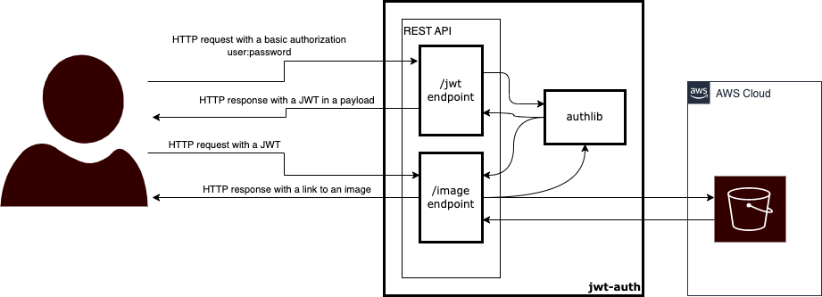

# JWT Authentication & Authorization Example

This simple web app was written for the _Authentication & Authorization using JSON Web Tokens_ 
presentation purposes which was shown during the 
[wroc.py meetup event](https://www.meetup.com/wrocpy/events/288952995/).

The only feature that this web app has is returning a random presigned URL to one of the files in the AWS S3 
bucket under a stated folder. To make it possible you one must state the AWS credentials and other variables 
in the `.env` file. Please see the [.env-schema file](./.env-schema) to see all the necessary configuration.

### Installation in the isolated environment using [venv](https://docs.python.org/3/library/venv.html)
1. Go to the jwt-auth's main directory, i.e. to the directory where this `README.md` file is located.
1. Create a virtual environment (jwt-auth requires `python 3.11` installed)
    ```sh
    python3.11 -m venv ./venv/
    ```
1. Activate new virtual environment
    ```sh
    source ./venv/bin/activate
    ```
1. Install requirements
    ```sh
    pip install poetry && poetry install
    ```
1. To exit, simply type
    ```sh
    deactivate
    ```

### Run

```shell
gunicorn --reload jwt_auth.app
```

### Request endpoints

#### /jwt

```shell
curl -v -X POST localhost:8000/jwt -H "authorization: {user:password base64 encoded}"
```

#### /image
```shell
curl -v -X GET localhost:8000/image -H "authorization: Bearer {JWT base64 encoded}"
```


### Diagram

